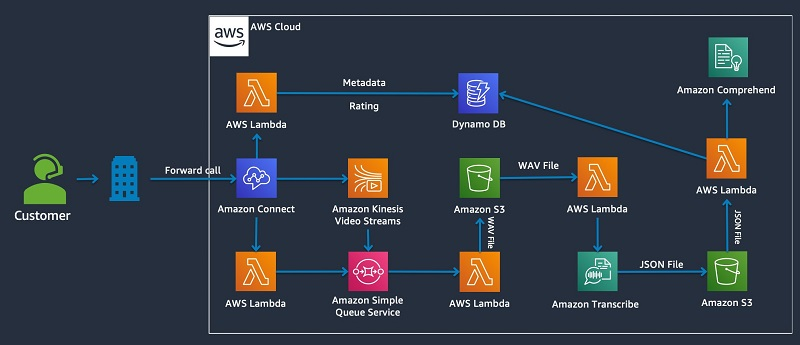
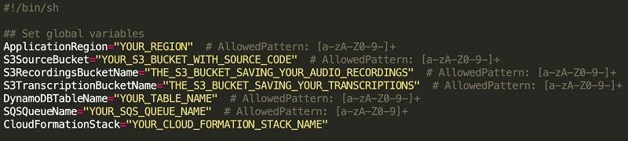

# Setup an IVR to collect customer feedback via phone using Amazon Connect

## Solution overview

We guide you through the following steps, all of which may be done in only a few minutes:

1. Upload the content to an Amazon Simple Storage Service (Amazon S3) bucket in your account.
2. Run an AWS CloudFormation template.
3. Set up your Amazon Connect contact center.
4. Generate a phone number.
5. Attach a contact flow to this number.
6. Publish your first IVR phone feedback system.

The following diagram shows the serverless architecture that you build:




## Download the Github Repository

As a first step, download the GitHub repository for this post.

```bash
git clone git@github.com:aws-samples/amazon-connect-collect-feedback-via-phone-ivr.git
cd amazon-connect-collect-feedback-via-phone-ivr
```

We use the *build.sh* file to deploy all the resources in your account. You need the AWS Command Line Interface (AWS CLI) and Gradle to compile, upload, and deploy your resources.

## Running the build script

Before we can run the build, we need to open the build.sh file and set a Region, S3 bucket name, and other information. The script performs the following steps for you:

* Creates a S3 bucket that hosts your CloudFormation template and Lambda source code
* Builds the Gradle project (a Java-based Lambda function) to extract voice from a video stream (see also the following GitHub repository)
* Zip all Lambda functions from the src folder
* Upload the CloudFormation template and the zipped Lambda functions
* Create a CloudFormation stack

The top of this script looks like the following screenshot:



Provide your preferred setup parameters and make sure you comply with the allowed pattern. You fill out the following fields:

* ApplicationRegion – The Region in which your IVR is deployed.
* S3SourceBucket – The name of the S3 bucket that is created during the build phase. Your CloudFormation template and Lambda code resources are uploaded to this bucket as part of this script.
* S3RecordingsBucketName – This is where the open feedback field (WAV recordings) are stored in your IVR feedback channel.
* S3TranscriptionBucketName – After the WAV files are transcribed, the JSON output is saved here and a Lambda function—as part of your CloudFormation stack—is triggered.
* DynamoDBTableName – The name of your DynamoDB table where the feedback data is stored.
* SQSQueueName – The SQS queue that orchestrates the extraction of the customer open feedback.
* CloudFormationStack– The name of the CloudFormation stack that is created to deploy all the resources.

After you fill in the variables with the proper values, you can run the script. Open your bash terminal on your laptop or computer and navigate to the downloaded folder. Then run the following code:

```bash
./build.sh
```

## Congrats

All resources are now installed in your account. You can now continue with [the blog post](https://aws-preview.aka.amazon.com/blogs/machine-learning/setting-up-an-ivr-to-collect-customer-feedback-via-phone-using-amazon-connect-and-aws-ai-services/) in section **Creating an Amazon Connect instance**.